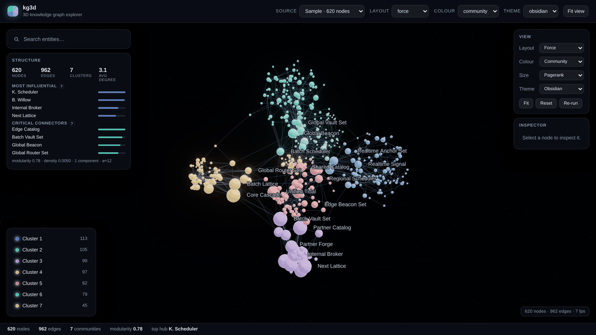

<div align="center">

# kg3d

**A 3D interactive knowledge graph library — WebGL engine, React bindings, and an optional graph service.**

[](https://github.com/pavan1586/kg3d/actions/workflows/ci.yml)
[](https://www.npmjs.com/package/@kg3d/core)
[](LICENSE)
[](THIRD-PARTY-NOTICES.md)

[**Live demo**](https://pavan1586.github.io/kg3d/) · [Documentation](docs/) · [API reference](docs/api.md)



</div>

---

kg3d is built around one idea: **a 3D graph is only worth the extra dimension if
it tells you something a 2D one can't.** So the visual layer stays quiet — no
neon, no spinning for its own sake — and the effort goes into the things that
produce insight: community structure you can see, centrality you can rank, focus
that hides everything irrelevant, and paths you can trace between any two nodes.

## Install

```bash
npm install @kg3d/core three
```

```ts
import { KnowledgeGraph3D } from '@kg3d/core';

const graph = new KnowledgeGraph3D(document.getElementById('app')!, {
  data: { nodes, edges },
  colorBy: { by: 'community' },
  sizeBy: { by: 'metric', metric: 'pagerank' },
});

graph.on('nodeClick', ({ node }) => console.log(node.id));
graph.focus('service-42'); // fly to it, dim everything outside its neighbourhood
graph.showPath('team-a', 'policy-9'); // trace the shortest path between two nodes
```

That is the whole setup. Layout, analytics, search, focus, path tracing and the
built-in HUD all run in the browser — **there is no backend to stand up.**
three.js is the only runtime dependency, and it has none of its own.

### React

```bash
npm install @kg3d/react three
```

```tsx
import { KnowledgeGraph, useGraphInsights } from '@kg3d/react';

function Explorer({ data }) {
  const [graph, setGraph] = useState(null);
  const insights = useGraphInsights(graph);

  return (
    <>
      <KnowledgeGraph data={data} colorBy={{ by: 'community' }} onReady={setGraph} />
      {insights?.hubs.map((hub) => (
        <button key={hub.id} onClick={() => graph.focus(hub.id)}>
          {hub.label}
        </button>
      ))}
    </>
  );
}
```

### One script tag, no build step

```html
<div id="graph" style="width: 100%; height: 100vh"></div>
<script src="https://cdn.jsdelivr.net/npm/@kg3d/core/dist/kg3d.global.js"></script>
<script>
  new kg3d.KnowledgeGraph3D(document.getElementById('graph'), {
    data: { nodes, edges },
  });
</script>
```

three.js is bundled into that build, so there is no import map and nothing to
configure. See [`examples/script-tag.html`](examples/script-tag.html) — or
[`examples/kg3d-atlas.html`](examples/kg3d-atlas.html), a complete explorer in a
single dependency-free file you can open straight from disk.

## What it does

**Rendering.** The whole graph is two draw calls — one instanced mesh for nodes,
one line list for edges — so 50k nodes hold an interactive frame rate. Labels
are drawn on a 2D overlay with screen-space decluttering, which is why a dense
graph stays readable instead of becoming a wall of overlapping text.

**Layout.** A Barnes-Hut force simulation runs in a Web Worker, so the graph
settles while the UI stays responsive, and the camera follows it in until you
take over. Five instant presets — cluster, sphere, radial, hierarchy, grid —
answer different questions about the same data. A force layout tells you what is
near what; a hierarchy tells you what sits above what; a radial tells you how far
everything is from _this_. Switching between them is the cheapest analysis in
the library.

**Insight.** PageRank, betweenness, closeness, clustering coefficient and
multi-level Louvain community detection, in the browser or exactly on the
server. The HUD turns those into the two lists that are usually the first real
finding: _most influential_ (what the graph is organised around) and _critical
connectors_ (what it falls apart without).

**Interaction.** GPU picking makes hover and click constant-time in graph size.
Focus a node to fly to it and dim everything outside its neighbourhood; drag a
node to pin it; click a legend row to isolate a type; select two nodes to trace
the shortest path between them.

**Scale.** Levels of detail: level 0 is one node per community, level 1 is each
community's backbone, level 2 is everything. A graph too big to render is
explored by drilling down rather than by waiting.

## The graph service — optional

Everything above works without it. The service in [`services/api`](services/api)
exists for what a browser shouldn't do: exact betweenness on a large graph, a
layout computed once and shared by every viewer instead of once per tab, and
graphs too big to send in full. When it is present, the client adopts the
analytics it has already computed instead of recomputing them, so the two never
disagree about which node is the biggest hub.

```bash
pip install -e 'services/api[dev]'
uvicorn app.main:app --reload --app-dir services/api   # http://localhost:8000/docs
```

```ts
import { KnowledgeGraph3D, RestAdapter } from '@kg3d/core';

new KnowledgeGraph3D(container, {
  adapter: new RestAdapter({ baseUrl: '/api/v1', graphId: 'demo', withMetrics: true }),
});
```

Pointing it at your own data is configuration, not code — adapters ship for JSON
files, SQL (via SQLAlchemy), Neo4j, and in-memory graphs pushed over the API:

```bash
KG3D_SOURCES='[{"id":"assets","kind":"sql","options":{
  "dsn":"postgresql+psycopg://user:pass@db/inventory",
  "node_query":"SELECT id, name AS label, kind AS type FROM assets",
  "edge_query":"SELECT src AS source, dst AS target, relation AS type FROM asset_links"}}]'
```

> **Before deploying it:** the service is designed to sit behind your own gateway
> on a private network. CORS is closed by default and the write endpoints are
> open unless you set `KG3D_API_KEY`. Read [SECURITY.md](SECURITY.md) first.

Or run the whole stack:

```bash
docker compose -f docker/docker-compose.yml up --build   # http://localhost:8080
```

## Repository

```
packages/core      @kg3d/core   — framework-agnostic TypeScript engine (three.js)
packages/react     @kg3d/react  — React component + hooks
apps/demo                       — Vite demo application
services/api                    — FastAPI graph service
docker                          — compose stack: API + static web
docs                            — architecture, API, embedding, options, performance
examples                        — no-build examples and sample data
```

```bash
npm install && npm run build     # the demo needs the packages built first
npm run dev                      # http://localhost:5173
npm run verify                   # format, typecheck, build, tests — what CI runs
```

## Documentation

| Document                                     | What's in it                                                                 |
| -------------------------------------------- | ---------------------------------------------------------------------------- |
| [docs/embedding.md](docs/embedding.md)       | Integration recipes: bundled, React, script tag, custom UI, your own adapter |
| [docs/options.md](docs/options.md)           | Every option, method and event                                               |
| [docs/architecture.md](docs/architecture.md) | How the pieces fit, and why they are split that way                          |
| [docs/api.md](docs/api.md)                   | HTTP and WebSocket reference for the service                                 |
| [docs/performance.md](docs/performance.md)   | Measured numbers, and what to turn down first                                |

## Requirements

Node 18+ and a WebGL2 browser (Chrome/Edge 90+, Firefox 90+, Safari 15+). Python
3.10+ only if you run the service. The packages are **ESM-only** — `require()`
is not supported.

## Contributing

Issues, reproductions and pull requests are welcome — see
[CONTRIBUTING.md](CONTRIBUTING.md). For vulnerabilities, please use
[private reporting](SECURITY.md) rather than a public issue.

## Licence

MIT — see [LICENSE](LICENSE). Third-party notices are in
[THIRD-PARTY-NOTICES.md](THIRD-PARTY-NOTICES.md).

Copyright © 2026 Pavan Kumar Medheramitla.
